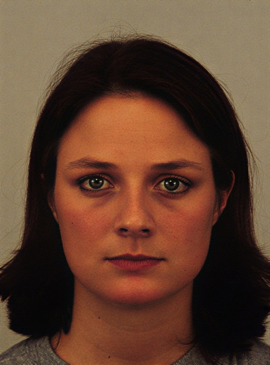
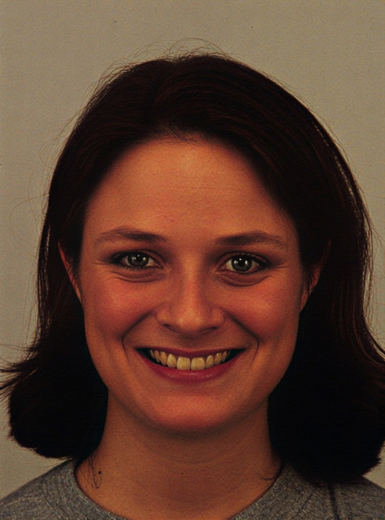
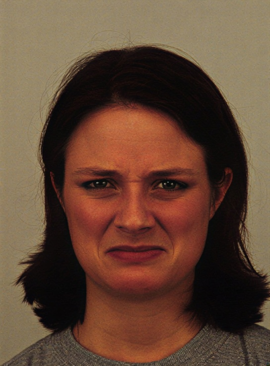
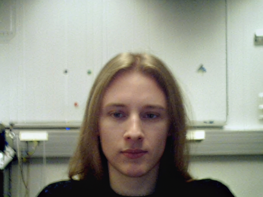

# FacePairEmoji

**A Multi-Resolution Paired Facial Expression Dataset for Flux Fine-Tuning**

FacePairEmoji is a carefully constructed multi-resolution, multi-expression paired face dataset designed for fine-tuning [Flux Kontext](https://github.com/black-forest-labs/flux) diffusion models. It provides same-person, different-expression image pairs across 64 resolution buckets (256px–2048px), preserving the base model's multi-resolution generation capabilities during fine-tuning.

---

## Paired Examples

<table>
<tr>
<th>Person</th>
<th>Neutral</th>
<th>Happy</th>
<th>Sad</th>
<th>Angry</th>
<th>Surprise</th>
<th>Fear</th>
<th>Disgust</th>
</tr>
<tr>
<td><b>raf_train_00042</b><br><sub>832×1248</sub></td>
<td><br><sub>Original</sub></td>
<td><br><sub>Generated</sub></td>
<td><br><sub>Generated</sub></td>
<td><br><sub>Generated</sub></td>
<td><br><sub>Generated</sub></td>
<td><br><sub>Generated</sub></td>
<td><br><sub>Generated</sub></td>
</tr>
<tr>
<td><b>kdef_AF01</b><br><sub>544×736</sub></td>
<td><br><sub>Original</sub></td>
<td><br><sub>Original</sub></td>
<td><br><sub>Original</sub></td>
<td><br><sub>Original</sub></td>
<td><br><sub>Original</sub></td>
<td><br><sub>Original</sub></td>
<td><br><sub>Original</sub></td>
</tr>
<tr>
<td><b>oulu_001</b><br><sub>448×336</sub></td>
<td><br><sub>Original</sub></td>
<td><br><sub>Original</sub></td>
<td><br><sub>Original</sub></td>
<td><br><sub>Original</sub></td>
<td><br><sub>Original</sub></td>
<td><br><sub>Original</sub></td>
<td><br><sub>Original</sub></td>
</tr>
</table>

> 📌 **占位说明**：上方图片路径指向 `assets/demo/`，请替换为实际的示例图片。RAF 行中除 neutral 为真实图片外，其余 6 张均为 API 生成的合成图像。

---

## Table of Contents

- [Why Paired Data?](#why-paired-data)
- [Dataset Highlights](#dataset-highlights)
- [Source Datasets](#source-datasets)
- [Processing Pipeline Overview](#processing-pipeline-overview)
- [Step 1: Source Data Curation](#step-1-source-data-curation)
- [Step 2: Multi-Resolution Bucket Design](#step-2-multi-resolution-bucket-design)
- [Step 3: Bucket Allocation](#step-3-bucket-allocation)
- [Step 4: Super-Resolution with SeedVR2](#step-4-super-resolution-with-seedvr2)
- [Step 5: Resize to Target Resolution](#step-5-resize-to-target-resolution)
- [Step 6: RAF Expression Generation via API](#step-6-raf-expression-generation-via-api)
- [Step 7: API Output Resize](#step-7-api-output-resize)
- [Dataset Statistics](#dataset-statistics)
- [Directory Structure](#directory-structure)
- [Usage](#usage)
- [License](#license)
- [Citation](#citation)
- [Acknowledgments](#acknowledgments)

---

## Why Paired Data?

Controllable facial expression generation requires the model to learn a precise mapping: **given a person's face and a target expression, produce that same person with the specified expression while preserving identity**. This is fundamentally different from unconditional face generation.

To learn this mapping, the model needs **paired training data** — multiple images of **the same person** showing **different expressions**:

| Training Signal | What the Model Learns |
|---|---|
| Same person, neutral → happy | How to add a smile while keeping identity intact |
| Same person, neutral → angry | How to add frown/tension while keeping identity intact |
| Same person across all 7 expressions | Disentangled representation of identity vs. expression |

**Without paired data**, the model can only learn correlations between expression labels and generic facial features, resulting in:
- Identity drift: the generated face looks like a different person
- Expression leakage: mixing attributes from different people
- Mode collapse: generating a "generic happy face" instead of making *this specific person* happy

**With paired data**, the model explicitly learns that the only variable between images in a pair is the expression — everything else (identity, lighting, pose, background) remains constant. This supervision signal is critical for achieving **identity-preserving expression control**.

---

## Dataset Highlights

- **🎯 Identity-Preserving Pairs**: Every person has 7 expression variants (neutral + 6 basic emotions) that maintain strict identity consistency
- **📐 64 Resolution Buckets**: Aligned to [Flux](https://github.com/black-forest-labs/flux) official aspect ratios, spanning 256px to 2048px, preventing catastrophic forgetting during fine-tuning
- **🔬 SeedVR2 Super-Resolution**: All images enhanced by [SeedVR2-7B](https://github.com/ByteDance-Seed/SeedVR) (ICLR 2026), a state-of-the-art one-step diffusion restoration model, ensuring sharp facial details at every resolution
- **⚖️ Balanced Distribution**: Uniform person count across all 64 buckets (max difference ≤ 1 person per bucket)
- **🧩 Hybrid Construction**: Combines real paired data (Multi-PIE, KDEF, Oulu-CASIA) with API-synthesized pairs (RAF-DB), totaling 3,603 unique individuals
- **✅ Flux-Compatible Alignment**: All dimensions are multiples of 16, satisfying VAE (÷8), Patchify (÷16), and Sequence Packing (even latent dims) constraints with zero padding

---

## Source Datasets

We leverage four publicly available face datasets, each contributing different strengths:

| Dataset | Type | People | Expressions | Resolution | Characteristics |
|---------|------|--------|-------------|------------|-----------------|
| [**Multi-PIE**](https://www.cs.cmu.edu/afs/cs/project/PIE/MultiPie/Multi-Pie/Home.html) | Paired | 249 | 2 (neutral + smile) | 128×128 | Large subject pool, low resolution, controlled lab conditions |
| [**KDEF**](https://www.kdef.se/) | Paired | 70 | 7 (neutral + 6 basic) | 562×762 | Medium resolution, full expression set, frontal-pose selected |
| [**Oulu-CASIA**](https://www.ee.oulu.fi/~gyzhao/Download/Databases/Oulu-CASIA/Oulu-CASIA.html) | Paired | 80 | 7 (neutral + 6 basic) | 320×240 | Low-medium resolution, strong illumination variations |
| [**RAF-DB**](http://www.whdeng.cn/raf/model1.html) | Unpaired | 3,204 | 1 (neutral only, extracted) | Varied (91–1,200px) | Large-scale, diverse in-the-wild faces, single-label annotations |

> **Key distinction**: Multi-PIE, KDEF, and Oulu-CASIA provide **naturally paired** expressions (the same person photographed in multiple expressions). RAF-DB only provides single images with expression labels — it does **not** contain paired data. We extract neutral-expression images from RAF-DB and synthesize the remaining 6 expression variants via a generative API (see [Step 6](#step-6-raf-expression-generation-via-api)).

---

## Processing Pipeline Overview

```
┌─────────────────────────────────────────────────────────────────────┐
│                    Paired Datasets (v1)                             │
│              Multi-PIE / KDEF / Oulu-CASIA                          │
│                                                                     │
│  ① Curate (frontal, good lighting)                                  │
│         │                                                           │
│  ② Design Flux-aligned multi-resolution buckets (64 buckets)        │
│         │                                                           │
│  ③ Allocate people to buckets (balanced)                            │
│         │                                                           │
│  ④ SeedVR2-7B super-resolution to target resolution                 │
│         │                                                           │
│  ⑤ Lanczos resize to exact bucket dimensions                        │
└─────────────────────────────────────────────────────────────────────┘

┌─────────────────────────────────────────────────────────────────────┐
│                   Unpaired Dataset (RAF)                            │
│                       RAF-DB                                        │
│                                                                     │
│  ① Extract neutral images (label=7)                                 │
│         │                                                           │
│  ② Allocate to 64 buckets (balanced)                                │
│         │                                                           │
│  ③ SeedVR2-7B super-resolution                                      │
│         │                                                           │
│  ④ Lanczos resize to exact bucket dimensions                        │
│         │                                                           │
│  ⑤ Compute 2K-proportional resolution for API call                  │
│         │                                                           │
│  ⑥ API generates 6 expression variants at 2K resolution             │
│         │                                                           │
│  ⑦ Lanczos resize API output to exact bucket dimensions             │
└─────────────────────────────────────────────────────────────────────┘
```

---

## Step 1: Source Data Curation

### 1.1 Paired Datasets (Multi-PIE, KDEF, Oulu-CASIA)

From each dataset, we select only images meeting these criteria:

- **Frontal pose**: Near-zero yaw/pitch angle to ensure full face visibility
- **Good illumination**: Frontal or evenly distributed lighting to avoid shadow artifacts
- **No occlusion**: No sunglasses, hands covering face, or other obstructions

For [**KDEF**](https://www.kdef.se/), images were originally captured under multiple angles — we selected only the straight-ahead (`S` suffix) photographs. For [**Multi-PIE**](https://www.cs.cmu.edu/afs/cs/project/PIE/MultiPie/Multi-Pie/Home.html), we selected images from the frontal camera (camera 05_1) under neutral illumination conditions.

The curated data is organized as:

```
final_data_v1/
├── neutral/
│   ├── multi_pie_001_neutral.jpg
│   ├── kdef_AF01.jpg
│   └── oulu_001_neutral.jpg
├── happy/
├── sad/
├── angry/
├── surprise/
├── fear/
└── disgust/
```

### 1.2 RAF-DB: Neutral Image Extraction

[RAF-DB](http://www.whdeng.cn/raf/model1.html) provides single images with discrete expression labels (1=surprise, 2=fear, 3=disgust, 4=happy, 5=sad, 6=angry, 7=neutral). Since RAF-DB is an **unpaired** dataset — each image shows a different person in a single expression — it cannot directly provide expression pairs.

Our strategy: **extract all neutral-labeled images** (label=7) as seed images, then synthesize the remaining 6 expression variants using a generative API (see [Step 6](#step-6-raf-expression-generation-via-api)).

```
final_data_raf/
└── neutral/
    ├── raf_test_0001.jpg
    ├── raf_test_0002.jpg
    └── ...  (3,204 images)
```

---

## Step 2: Multi-Resolution Bucket Design

### 2.1 Why Multi-Resolution?

The [Flux](https://github.com/black-forest-labs/flux) model family uses a **Diffusion Transformer (DiT)** architecture with **Rotary Position Embedding (RoPE)** for spatial position encoding. Unlike fixed-resolution models, Flux processes images as variable-length token sequences:

```
Image (H×W) → VAE Encode (8× downsample) → Patchify (2×2) → Token Sequence (L = H×W / 256)
```

During pre-training, Flux was exposed to images at many different resolutions and aspect ratios, allowing RoPE to learn position encodings across diverse spatial configurations. If we fine-tune only on a single resolution, the model will "forget" how to generate at other resolutions — a form of **catastrophic forgetting**.

> **Principle**: Fine-tuning data should cover the same resolution distribution as pre-training data to prevent catastrophic forgetting.

### 2.2 Flux Official Resolution Buckets

From the [Flux official source code](https://github.com/black-forest-labs/flux/blob/main/src/flux/util.py) (`src/flux/util.py`), the 17 preferred aspect ratios at ~1 megapixel are:

```python
PREFERED_KONTEXT_RESOLUTIONS = [
    (672, 1568), (688, 1504), (720, 1456), (752, 1392),
    (800, 1328), (832, 1248), (880, 1184), (944, 1104),
    (1024, 1024),
    (1104, 944), (1184, 880), (1248, 832), (1328, 800),
    (1392, 752), (1456, 720), (1504, 688), (1568, 672),
]
```

These 17 ratios range from ~0.43:1 (extreme portrait) to ~2.33:1 (extreme landscape), all at approximately 1,048,576 pixels (~1024²).

### 2.3 Multi-Tier Bucket Generation

To cover the full resolution range Flux supports (256px–2048px), we scale the official aspect ratios to **10 pixel-area tiers**:

$$\text{TargetPixels}_{\text{tier}} = \text{base}^2, \quad \text{base} \in \{256, 384, 512, 640, 768, 896, 1024, 1280, 1536, 2048\}$$

For each tier and each reference ratio $(W_{\text{ref}}, H_{\text{ref}})$, the bucket dimensions are computed as:

$$\text{scale} = \sqrt{\frac{\text{TargetPixels}_{\text{tier}}}{W_{\text{ref}} \times H_{\text{ref}}}}$$

$$W_{\text{bucket}} = \text{round}\!\left(\frac{W_{\text{ref}} \times \text{scale}}{16}\right) \times 16, \quad H_{\text{bucket}} = \text{round}\!\left(\frac{H_{\text{ref}} \times \text{scale}}{16}\right) \times 16$$

The rounding to multiples of **16** satisfies all Flux architecture constraints simultaneously:

| Component | Alignment Required | Reason |
|-----------|-------------------|--------|
| VAE Encoder | ÷ 8 | 8× spatial downsampling |
| Patchify | ÷ 16 | 2×2 patches on latent space (8×2 = 16 in pixel space) |
| Sequence Packing | (W/8) and (H/8) must be even | Token packing for attention |

Since 16 is a common multiple of all three requirements, **all constraints are automatically satisfied**.

### 2.4 Face-Friendly Aspect Ratio Selection

Not all 17 Flux aspect ratios are suitable for face images. Extreme landscape ratios (e.g., 1568×672, ~2.33:1) would require heavy cropping or distortion. We select **7 face-friendly ratios**:

| Ratio (at ~1024 tier) | W : H | Orientation | Suitable For |
|------------------------|-------|-------------|--------------|
| 832 × 1248 | ~2:3 | Portrait | Half-body, ID-style |
| 880 × 1184 | ~3:4 | Portrait | Classic portrait |
| 944 × 1104 | ~6:7 | Near-square (portrait) | Face close-up |
| 1024 × 1024 | 1:1 | Square | Social media avatar |
| 1104 × 944 | ~7:6 | Near-square (landscape) | Face with context |
| 1184 × 880 | ~4:3 | Landscape | Face with background |
| 1248 × 832 | ~3:2 | Landscape | Wide portrait |

With 7 ratios × 10 tiers, filtering out any bucket where either dimension exceeds 2048px, we obtain **64 unique resolution buckets**.

### 2.5 Constraint Verification

All 64 buckets were verified to satisfy Flux's architecture requirements:

```python
for (W, H) in all_64_buckets:
    assert W % 16 == 0          # ✓ Patchify constraint
    assert H % 16 == 0          # ✓ Patchify constraint
    assert (W // 8) % 2 == 0    # ✓ Sequence packing constraint
    assert (H // 8) % 2 == 0    # ✓ Sequence packing constraint
    assert W <= 2048             # ✓ Maximum dimension
    assert H <= 2048             # ✓ Maximum dimension
```

---

## Step 3: Bucket Allocation

### 3.1 Design Goals

Each person's images must be assigned to **exactly one bucket** — all expressions of the same person share the same resolution. The allocation satisfies two goals:

1. **Uniform distribution**: Each of the 64 buckets should contain approximately the same number of people
2. **Minimal distortion**: Initially assign each person to the bucket closest to their original image resolution

### 3.2 Two-Phase Allocation Algorithm

**Phase 1 — Initial Assignment by Nearest Bucket**

Each person is assigned to the bucket whose aspect ratio is closest to their original image:

$$\text{bucket}^* = \arg\min_{(W_b,\, H_b)} \left| \frac{W_b}{H_b} - \frac{W_{\text{orig}}}{H_{\text{orig}}} \right|$$

With ties broken by pixel area proximity:

$$\text{(tie-break)}\; = \arg\min_{(W_b,\, H_b)} \left| W_b \cdot H_b - W_{\text{orig}} \cdot H_{\text{orig}} \right|$$

**Phase 2 — Iterative Rebalancing**

After initial assignment, some buckets may have many people while others have none. We iteratively rebalance:

```
while max(bucket_counts) - min(bucket_counts) > 1:
    move one person from argmax(bucket_counts) → argmin(bucket_counts)
```

This guarantees all buckets differ by at most **1 person**.

### 3.3 Allocation Results

| Dataset | People | Buckets Covered | People per Bucket |
|---------|--------|-----------------|-------------------|
| **v1** (Multi-PIE + KDEF + Oulu) | 399 | 64 / 64 | 6–7 |
| **RAF** (neutral only) | 3,204 | 64 / 64 | 50–51 |
| **Combined** | 3,603 | 64 / 64 | 56–58 |

---

## Step 4: Super-Resolution with SeedVR2

### 4.1 Why Super-Resolution Is Necessary

Most source images are significantly smaller than their target bucket resolution:

| Source | Original Resolution | Target Range | Upscale Factor |
|--------|-------------------|--------------|----------------|
| [Multi-PIE](https://www.cs.cmu.edu/afs/cs/project/PIE/MultiPie/Multi-Pie/Home.html) | 128×128 | 208×320 → 2048×2048 | 1.6× – 16× |
| [Oulu-CASIA](https://www.ee.oulu.fi/~gyzhao/Download/Databases/Oulu-CASIA/Oulu-CASIA.html) | 320×240 | 208×320 → 2048×2048 | 1× – 8.5× |
| [KDEF](https://www.kdef.se/) | 562×762 | 208×320 → 2048×2048 | 0.4× – 3.6× |
| [RAF-DB](http://www.whdeng.cn/raf/model1.html) | 91–1,200px (varied) | 208×320 → 2048×2048 | varies |

Simple interpolation (bicubic, Lanczos) produces blurry results at high upscale factors, especially destroying the fine-grained facial details (skin texture, hair strands, iris patterns) that are critical for expression recognition.

### 4.2 Why SeedVR2-7B

We use [**SeedVR2-7B**](https://github.com/ByteDance-Seed/SeedVR) (Wang et al., ICLR 2026), a state-of-the-art one-step diffusion transformer for image/video restoration:

| Feature | Benefit for FacePairEmoji |
|---------|--------------------------|
| **One-step inference** | Efficient batch processing of ~4,752 images |
| **Arbitrary resolution** | Directly super-resolve to any target bucket size |
| **Adaptive window attention** | Resolution-aware processing without patch artifacts |
| **7B parameters** | Sufficient capacity for fine-grained facial detail hallucination |
| **Identity preservation** | Adversarial training against real data maintains face identity |

The super-resolution is performed **per bucket** — all images assigned to a given bucket are super-resolved to that bucket's target resolution:

```bash
torchrun --nproc-per-node=8 inference_seedvr2_7b_img.py \
    --video_path INPUT_DIR \
    --output_dir OUTPUT_DIR \
    --res_h TARGET_H --res_w TARGET_W \
    --sp_size 1
```

---

## Step 5: Resize to Target Resolution

### 5.1 Why Resize After Super-Resolution?

[SeedVR2](https://github.com/ByteDance-Seed/SeedVR) internally applies `NaResize` (scale to target pixel area) followed by `DivisibleCrop` (crop to 16-pixel multiples). This process preserves the input's aspect ratio rather than forcing the exact target dimensions, so the output may be close to, but not exactly, the bucket's target $(W_b, H_b)$.

For example, targeting bucket 832×1248 might yield 832×1248 or 848×1232, depending on the input's original aspect ratio.

### 5.2 Final Lanczos Resize

After super-resolution, every image is resized to the **exact** bucket dimensions using high-quality Lanczos interpolation:

```python
img = img.resize((target_w, target_h), Image.LANCZOS)
```

Since SeedVR2 already outputs a high-resolution, high-quality image, this final resize is typically a very minor adjustment (< 5% in either dimension) and introduces **negligible quality loss**. The result is pixel-exact alignment with the target bucket, which is essential for batched training with Flux's aspect ratio bucketing.

---

## Step 6: RAF Expression Generation via API

### 6.1 Problem

[RAF-DB](http://www.whdeng.cn/raf/model1.html) contains only **single images per person** with expression labels — there are no paired images of the same person showing different expressions. To create the required paired training data, we need to **synthesize 6 additional expression variants** for each neutral image.

### 6.2 Solution: Instruction-Based Image Editing API

We use the **doubao-seedream** image editing API to generate expression variants from each neutral face. For each neutral image, 6 expression-specific prompts guide the model to produce:

> happy, sad, angry, surprise, fear, disgust

The API preserves the person's **identity** (face shape, skin tone, hair style, background) while modifying only the **facial expression**, leveraging instruction-based image editing capabilities.

### 6.3 Resolution Strategy: Generate High, Then Downscale

The API has specific constraints:

- **Minimum pixel count**: Requires input images above a minimum resolution threshold for quality generation
- **Aspect ratio preservation**: Output images maintain the input's aspect ratio
- **Optimal quality range**: Produces best results near ~2K resolution

Since our target buckets span from 208×320 (tiny) to 2048×2048 (large), requesting the API to generate directly at small bucket sizes would produce low-quality results with poor facial details. We therefore adopt a **generate-high-then-downscale** strategy.

**Step 6.3.1: Compute the 2K-proportional resolution**

For a target bucket $(W_b, H_b)$, we scale its dimensions to ~2K pixel area while preserving the aspect ratio:

$$\text{scale}_{2K} = \sqrt{\frac{2048^2}{W_b \times H_b}}$$

$$W_{\text{api}} = \text{round}\!\left(\frac{W_b \times \text{scale}_{2K}}{16}\right) \times 16, \quad H_{\text{api}} = \text{round}\!\left(\frac{H_b \times \text{scale}_{2K}}{16}\right) \times 16$$

This ensures:
- The API always generates at **high resolution** (near 2K) for maximum quality
- The **aspect ratio is preserved**: $\frac{W_{\text{api}}}{H_{\text{api}}} \approx \frac{W_b}{H_b}$
- The dimensions are aligned to **16-pixel multiples**

**Worked example** — target bucket 416×624 (~512 tier):

$$\text{scale}_{2K} = \sqrt{\frac{4{,}194{,}304}{416 \times 624}} = \sqrt{\frac{4{,}194{,}304}{259{,}584}} \approx 4.02$$

$$W_{\text{api}} = \text{round}\!\left(\frac{416 \times 4.02}{16}\right) \times 16 = 1680$$

$$H_{\text{api}} = \text{round}\!\left(\frac{624 \times 4.02}{16}\right) \times 16 = 2512$$

**Step 6.3.2: Generate at 2K resolution**

```python
response = client.images.edit(
    model="doubao-seedream-5-0-260128",
    image=base64_neutral_image,       # super-resolved neutral face
    prompt=expression_prompt,          # e.g., "Make this person look happy"
    size=f"{W_api}x{H_api}",         # e.g., "1680x2512"
    response_format="b64_json",
)
```

**Step 6.3.3: Downscale to target bucket**

```python
generated_img = generated_img.resize((W_b, H_b), Image.LANCZOS)  # 1680×2512 → 416×624
```

This two-step approach ensures that **expression details** (subtle muscle movements, teeth visibility, wrinkle patterns) are generated at full quality before being downscaled, rather than being generated at a low resolution where these details would be lost or artifacts would appear.

---

## Step 7: API Output Resize

After API generation, all expression variants are Lanczos-resized to their exact bucket dimensions. This final step guarantees:

| Guarantee | Why It Matters |
|-----------|---------------|
| **Pixel-exact bucket alignment** | Every image in a bucket has exactly $(W_b, H_b)$ pixels |
| **Same-person resolution consistency** | All 7 images of one person are at identical resolution |
| **Flux architecture compatibility** | All dimensions are multiples of 16 |
| **Batch training efficiency** | Same-bucket images can be directly batched without padding |

---

## Dataset Statistics

### Overall

| Metric | Value |
|--------|-------|
| Dataset name | **FacePairEmoji** |
| Total unique individuals | 3,603 |
| Expressions per person | 7 (neutral + 6 basic emotions) |
| Resolution buckets | 64 |
| Face-friendly aspect ratios | 7 |
| Pixel-area tiers | 10 (256² to 2048²) |
| Total images | ~25,221 |

### Per-Source Breakdown

| Source | People | Expressions / Person | Original Resolution | Pair Type |
|--------|--------|---------------------|---------------------|-----------|
| [Multi-PIE](https://www.cs.cmu.edu/afs/cs/project/PIE/MultiPie/Multi-Pie/Home.html) | 249 | 2 (neutral + smile) | 128×128 | Real paired |
| [KDEF](https://www.kdef.se/) | 70 | 7 | 562×762 | Real paired |
| [Oulu-CASIA](https://www.ee.oulu.fi/~gyzhao/Download/Databases/Oulu-CASIA/Oulu-CASIA.html) | 80 | 7 | 320×240 | Real paired |
| [RAF-DB](http://www.whdeng.cn/raf/model1.html) | 3,204 | 7 (1 real + 6 synthesized) | 91–1,200px | Synthesized paired |

### Bucket Distribution

People are **uniformly distributed** across all 64 buckets:

- **v1_bucket**: 6–7 people per bucket (399 total across 64 buckets)
- **raf_bucket**: 50–51 people per bucket (3,204 total across 64 buckets)
- **Combined**: 56–58 people per bucket

### Resolution Tier Details

| Tier | Pixel Area | Buckets | Aspect Ratios Covered |
|------|-----------|---------|----------------------|
| 256² | ~65K | 7 | All 7 face-friendly |
| 384² | ~147K | 7 | All 7 |
| 512² | ~262K | 7 | All 7 |
| 640² | ~410K | 7 | All 7 |
| 768² | ~590K | 7 | All 7 |
| 896² | ~803K | 7 | All 7 |
| 1024² | ~1.05M | 7 | All 7 |
| 1280² | ~1.64M | 7 | All 7 |
| 1536² | ~2.36M | 5 | Filtered (max dim ≤ 2048) |
| 2048² | ~4.19M | 1 | Square only |

---

## Directory Structure

```
FacePairEmoji/
├── final_data_v1_bucket/              # Paired datasets (Multi-PIE, KDEF, Oulu)
│   ├── 256x256/
│   │   ├── neutral/
│   │   │   ├── multi_pie_001_neutral.jpg
│   │   │   └── ...
│   │   ├── happy/
│   │   ├── sad/
│   │   ├── angry/
│   │   ├── surprise/
│   │   ├── fear/
│   │   └── disgust/
│   ├── 832x1248/
│   │   └── ...
│   └── ...                            (64 bucket directories)
│
├── final_data_raf_bucket/             # RAF-DB synthesized pairs
│   ├── 256x256/
│   │   ├── neutral/                   # Real neutral images (super-resolved)
│   │   │   ├── raf_test_0001.jpg
│   │   │   └── ...
│   │   ├── happy/                     # API-generated expressions
│   │   ├── sad/
│   │   ├── angry/
│   │   ├── surprise/
│   │   ├── fear/
│   │   └── disgust/
│   └── ...                            (64 bucket directories)
│
├── scripts/
│   ├── stat_resolution.py             # Resolution distribution analysis
│   ├── allocate_buckets.py            # Bucket allocation (balanced)
│   ├── seedvr2_upscale_buckets.py     # SeedVR2 batch super-resolution
│   ├── inference_seedvr2_7b_img.py    # Modified SeedVR2 inference (image input)
│   ├── resize_to_buckets.py           # Final Lanczos resize
│   ├── generate_raf_expressions.py    # API-based expression synthesis
│   └── verify_buckets.py              # Allocation verification
│
├── assets/
│   └── demo/                          # Example images for README
│
└── README.md
```

---

## Usage

### Loading the Dataset

```python
from pathlib import Path
from PIL import Image

dataset_root = Path("final_data_v1_bucket")

for bucket_dir in sorted(dataset_root.iterdir()):
    if not bucket_dir.is_dir():
        continue
    w, h = map(int, bucket_dir.name.split('x'))
    
    neutral_dir = bucket_dir / "neutral"
    for img_path in sorted(neutral_dir.glob("*.jpg")):
        neutral = Image.open(img_path)  # size: (w, h)
        
        # Load corresponding expression variants
        for expr in ["happy", "sad", "angry", "surprise", "fear", "disgust"]:
            expr_path = bucket_dir / expr / img_path.name
            if expr_path.exists():
                expr_img = Image.open(expr_path)  # same (w, h)
                # → (neutral, expr_img) is a paired training sample
```

### Aspect Ratio Bucketing for Flux Training

For [Flux](https://github.com/black-forest-labs/flux) fine-tuning with [Aspect Ratio Bucketing](https://github.com/NovelAI/novelai-aspect-ratio-bucketing) (originated by [NovelAI](https://novelai.net/)):

```python
import random
from torch.utils.data import Sampler

class BucketBatchSampler(Sampler):
    """Groups same-bucket images into batches for efficient training."""
    def __init__(self, bucket_indices, batch_size):
        self.buckets = bucket_indices  # {bucket_name: [sample_indices]}
        self.batch_size = batch_size
    
    def __iter__(self):
        for bucket, indices in self.buckets.items():
            random.shuffle(indices)
            for i in range(0, len(indices), self.batch_size):
                yield indices[i:i + self.batch_size]
```

---

## License

- [**Multi-PIE**](https://www.cs.cmu.edu/afs/cs/project/PIE/MultiPie/Multi-Pie/Home.html): Subject to CMU Multi-PIE license
- [**KDEF**](https://www.kdef.se/): Subject to KDEF license (research use only)
- [**Oulu-CASIA**](https://www.ee.oulu.fi/~gyzhao/Download/Databases/Oulu-CASIA/Oulu-CASIA.html): Subject to University of Oulu license
- [**RAF-DB**](http://www.whdeng.cn/raf/model1.html): Subject to RAF-DB license (research use only)
- **Processing scripts**: MIT License

Please ensure compliance with individual dataset licenses before use.

---

## Citation

If you use FacePairEmoji in your research, please cite:

```bibtex
@misc{facepairemoji2026,
    title={FacePairEmoji: A Multi-Resolution Paired Facial Expression Dataset for Flux Fine-Tuning},
    year={2026},
    howpublished={\url{https://huggingface.co/datasets/YOUR_USERNAME/FacePairEmoji}},
    note={Constructed from Multi-PIE, KDEF, Oulu-CASIA, and RAF-DB with SeedVR2 super-resolution}
}
```

---

## Acknowledgments

FacePairEmoji is built upon the following outstanding works:

- [**SeedVR2**](https://github.com/ByteDance-Seed/SeedVR) — Wang et al., *"SeedVR2: One-Step Video Restoration via Diffusion Adversarial Post-Training"*, [ICLR 2026](https://openreview.net/forum?id=seedvr2)
- [**Flux**](https://github.com/black-forest-labs/flux) — Black Forest Labs, *FLUX.1 and FLUX.2 family of diffusion models*
- [**Multi-PIE**](https://www.cs.cmu.edu/afs/cs/project/PIE/MultiPie/Multi-Pie/Home.html) — Gross et al., *"Multi-PIE"*, Image and Vision Computing, 2010
- [**KDEF**](https://www.kdef.se/) — Lundqvist et al., *"The Karolinska Directed Emotional Faces"*, 1998
- [**Oulu-CASIA**](https://www.ee.oulu.fi/~gyzhao/Download/Databases/Oulu-CASIA/Oulu-CASIA.html) — Zhao et al., *"Facial Expression Recognition from Near-Infrared Videos"*, Image and Vision Computing, 2011
- [**RAF-DB**](http://www.whdeng.cn/raf/model1.html) — Li et al., *"Reliable Crowdsourcing and Deep Locality-Preserving Learning for Expression Recognition in the Wild"*, [CVPR 2017](https://openaccess.thecvf.com/content_cvpr_2017/html/Li_Reliable_Crowdsourcing_and_CVPR_2017_paper.html)
- [**Aspect Ratio Bucketing**](https://github.com/NovelAI/novelai-aspect-ratio-bucketing) — NovelAI, *Aspect Ratio Bucketing for efficient multi-resolution training*
